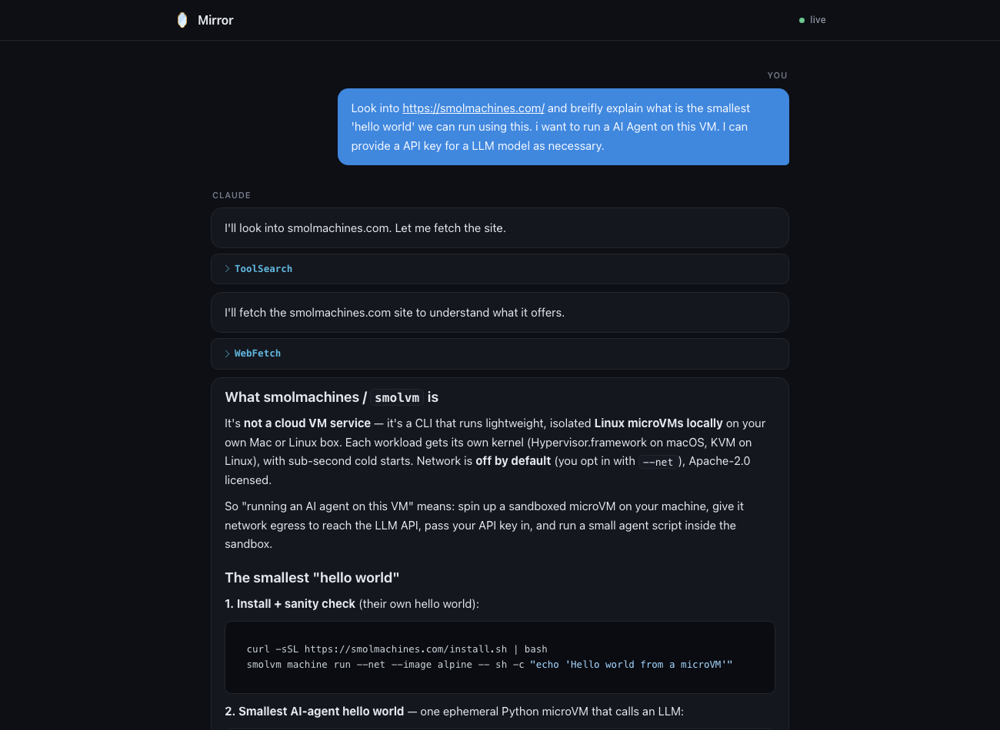

# 🪞 Mirror

A live, styled HTML view of your Claude Code conversation. Keep working in the
terminal; Mirror prints a localhost link, and that page shows the whole conversation
as a clean, auto-updating document.

- **No API cost.** Mirror never calls an LLM. It renders the transcript your session
  already writes to disk, so it rides on the Claude Code subscription you already have.
- **Localhost only.** The server binds to `127.0.0.1`. Your transcript (which can hold
  secrets, file contents, and tool output) never leaves your machine.
- **Zero dependencies.** Pure Python 3 standard library on the server. No `pip`, no `npm`.



## Requirements

- [Claude Code](https://claude.com/claude-code)
- Python 3.8+ (preinstalled on macOS and most Linux)

## Install

Clone the repo:

```bash
git clone https://github.com/anoopbhat44/mirror.git
```

Then load it as a plugin. For local use, point Claude Code at the directory:

```bash
claude --plugin-dir /path/to/mirror
```

To install it permanently via a local marketplace:

```bash
claude plugin marketplace add /path/to/mirror
claude plugin install mirror
```

After editing plugin files during development, run `/reload-plugins` inside Claude Code.

## Usage

1. Start Claude Code as you normally would.
2. Mirror prints a link on session start:
   ```
   🪞 Mirror live view: http://localhost:7842
   ```
3. Open the link. The page renders the conversation and updates after every turn.

That is the whole thing. Nothing else to run.

## How it works

```
Claude Code  ──writes──>  transcript .jsonl   (free, no tokens)
     │
 SessionStart / Stop hooks  ──>  local Python server (127.0.0.1)
     │                              watches the transcript, serves JSON + SSE
     └─ prints the link              │
                                     v
                          browser page renders + live-updates
```

- The `SessionStart` hook starts a small server (or reuses a running one) and prints
  the link.
- The server watches your transcript file and pushes an update (Server-Sent Events)
  whenever it changes.
- The browser fetches the parsed conversation and re-renders, preserving your scroll.

## Privacy

Everything is local. The server only listens on `127.0.0.1`, so the page is reachable
only from your machine. Mirror does not send your transcript anywhere. Public sharing is
a planned v2 feature and will be explicit and redacted (see [ROADMAP.md](ROADMAP.md)).

## Roadmap

v1 is the local live view. v2 adds structured artifacts and opt-in public sharing; later
versions add a multi-session workspace and team features. See [ROADMAP.md](ROADMAP.md).

## License

MIT. See [LICENSE](LICENSE).

Bundled third-party libraries in `client/vendor/` ([marked](https://github.com/markedjs/marked)
and [highlight.js](https://github.com/highlightjs/highlight.js)) are MIT licensed and used
for client-side rendering only.
